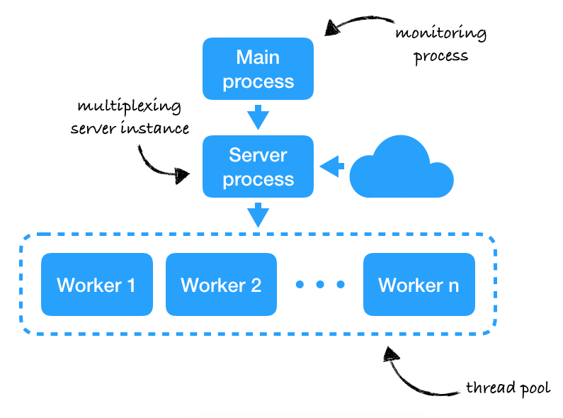

<div align="center">
  
</div>
<div align="center">
  <a href="https://gitlab.axgn.se/wsic/wsic/commits/development">
    
  </a>
  <a href="https://gitlab.axgn.se/wsic/wsic/commits/development">
    </a>
  <br>
  <strong>[Quick Start](#quick-start) | [Contribute](#contributing) </strong>
</div>

# WSIC
### An efficient web server written in C for the course DV1457 at BTH, Sweden
***

## Quick Start

#### Running using Docker

**Use the published image**

Make sure you meet the following prerequisites:
* `docker` is installed locally or configured to use another server
* You're authorized to pull from registry.axgn.se

```Bash
docker login registry.axgn.se
docker run -it -p8080:8080 registry.axgn.se/wsic/wsic
```

**Build and run image**

Make sure you meet the following prerequisites:
* `docker` is installed locally or configured to use another server

```Bash
# Clone the repository (or download it)
git clone ssh://git@git.axgn.se:2222/wsic/wsic.git

# Build the wsic docker image
cd wsic && make docker

# Run on port 8080
docker run -it -p8080:8080 wsic/wsic
```

##### Installing from prebuilt binaries

Make sure you meet the following prerequisites:
* `openssl 1.1.1` is installed (`apt install libssl1.1` on Ubuntu `brew install openssl@1.1` on macOS)

You can download the latest build [here](https://gitlab.axgn.se/wsic/wsic/builds/artifacts/development/download?job=build). Note however that this is a development build and will only run on an amd64 architecture on Ubuntu.  

##### Installing from source

Make sure you meet the following prerequisites:
* `$CC` refers to `gcc` 9 (`brew install gcc` on macOS) or `clang` 7
* `xxd` is installed (default on many distributions)
* `gnu sed` is installed and available as `sed` (default on many distributions, `brew install gnu-sed` on macOS)
* `openssl 1.1.1` is available in the system include path or `/usr/local/opt/openssl@1.1/include` (`apt install libssl-dev` on Ubuntu, `brew install openssl@1.1` on macOS)

_NOTE: For instructions on how to install all the prerequisites and building on Ubuntu, refer to the [Dockerfile](https://gitlab.axgn.se/wsic/wsic/blob/development/Dockerfile)._

```Bash
# Clone the repository (or download it)
git clone ssh://git@git.axgn.se:2222/wsic/wsic.git

# Build wsic
cd wsic && make

# Run
./build/wsic
```

## Documentation

The documentation is currently a bit sparse. For more information, refer to the source, tests and issues.

### Architecture



WSIC uses a modern approach to concurrency. Everything is entirely event-driven which allows for 0 idle CPU usage and close to 0 MB of memory usage.

WSIC also features a main process with the sole purpose of monitoring a server process. It sleeps most of the time and checks in from time to time or whenever the child process exits. In the vast majority cases WSIC is therefore able to recover from unexpected crashes with very low downtime measuring in milliseconds.

The server process of WSIC offers multiplexing with support for an amount of listening virtual hosts only limited by the host system. As quick as possible, WSIC accepts incoming requests and put them in a multi-threaded message queue.

This queue is consumed by a pool of worker which handles each request separately and concurrently. Whenever a worker is done handling a connection, it gets back to consuming the message queue which enables the worker to sleep most of the time. As previously stated, this allows WSIC to consume near 0 resources when idle.

### Security considerations

Processes started by WSIC inherits its permissions. This only really affects CGI processes. This means that if WSIC has access to a file, so do CGI processes. It's therefore important to configure WSIC to run as a seperate user on the system with access only to necessery parts. If possible, one can deploy jails or containers (see *Running with docker*).

## Contributing

Any contribution is welcome. If you're not able to code it yourself, perhaps someone else is - so post an issue if there's anything on your mind.

##### Development

Make sure you meet the following prerequisites:
* `$CC` refers to `gcc` 9 (`brew install gcc` on macOS) or `clang` 7
* `xxd` is installed (default on many distributions)
* `gnu sed` is installed and available as `sed` (default on many distributions, `brew install gnu-sed` on macOS)
* `clang` 7 is installed
* `gcov` refers to version 9 which comes with `gcc`
* `lcov` is installed (`brew install lcov` on macOS)
* `fastcov` is installed (`pip3 install fastcov`)
* `scan-build` refers to version 7 which comes with `clang`
* `clang-format` refers to version 7 which comes with `clang`
* `openssl 1.1.1` is available in the system include path or `/usr/local/opt/openssl@1.1/include` (`apt install libssl-dev` on Ubuntu, `brew install openssl@1.1` on macOS)

_NOTE: For instructions on how to install all the prerequisites on Ubuntu, refer to the CI image used by WSIC over at https://gitlab.axgn.se/wsic/ci-image (see `Dockerfile`)._

```Bash
# Clone the repository
git clone ssh://git@git.axgn.se:2222/wsic/wsic.git && cd wsic

# Lint
make lint

# Perform static analysis
make analyze
# The report is now available in build/reports/static-analysis

# Format the code
make format

# Build and run a debugging build (memory analyzer and GDB debugging enabled)
make debug && ASAN_OPTIONS=detect_leaks=1 LSAN_OPTIONS=suppressions=asan-ignores.txt ./build/wsic.debug

# Build and run a release build
make build && ./build

# Build a test build and run unit tests
make test && ./ci/test.sh
# Coverage report is now available in build/reports/test
```

##### Git branching conventions

The branches `master` and `development` are locked for pushing. Code is merged in to `development` by feature branches named `feature/my-feature`, `fix/my-fix` or the like. Try to keep the names concise and descriptive.

The feature branches should when applicable be up to speed to `development` via `git rebase development`. Feature branches are merged to `development` with `git merge --no-ff branch`. Feature branches may be squashed, but prefer to keep the history clean so that all commits can be kept.

When `development` is stable enough and provides meaningful value, it is merged into the `master` branch.

### Disclaimer

_Although the project is very capable, it is not built with production in mind. Therefore there might be complications when trying to use the server for large-scale projects meant for the public. The server was written by students as part of a course at BTH, Sweden and as such it might not promote best practices nor be performant._
